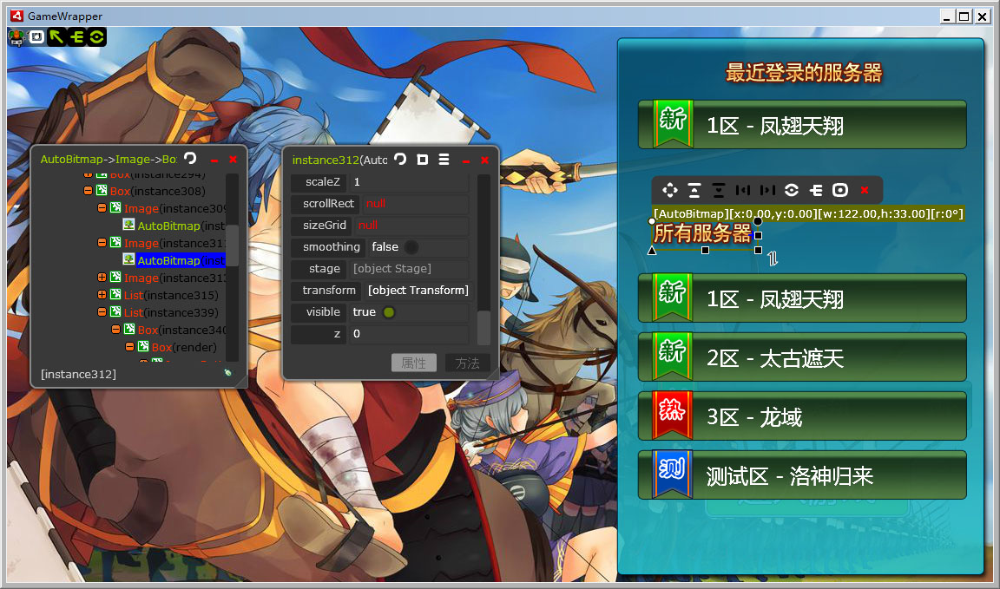
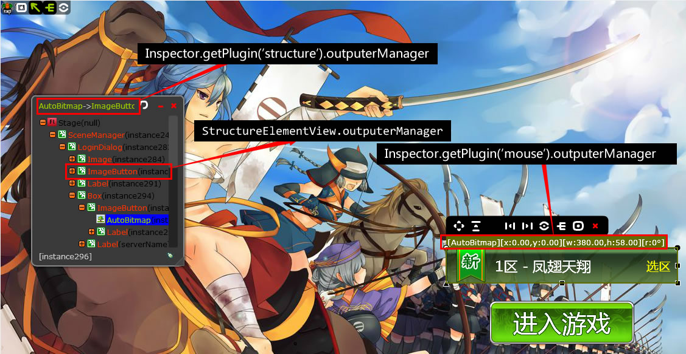

#介绍
[视频介绍（优酷）](http://v.youku.com/v_show/id_XMTg0NTc0MTc2.html)

tInspector是Flash运行时的界面调试工具，你可以在swf运行后查看显示列表的结构，查看修改显示对象的属性。tInspector也内置了变形2D、3D工具，可以对显示对象进行移动、旋转、扭曲。 
tInspector以插件机制来管理自身的功能，每个功能其实是tInspector的一个插件，目前提供以下功能（插件）：

- 移动鼠标查看显示对象(LiveInspectView)
- 查看显示对象属性(PropertiesView)
- 显示列表结构树(StructureView)
- 功能控制条(ControlBar)
- 全屏(FullScreen)
- 概要分析(AppStats，使用[Hi-ReS-Stats](https://github.com/mrdoob/Hi-ReS-Stats))

#安装

把swc下的tinspector.swc复制到as3项目的swc库路径下。

#使用

快速使用，直接调用`Inspector.init`方法即可，这样会启动核心插件：鼠标查看（LiveInspectView）、显示列表结构树（StructureView）、属性面板（PropertiesView）和控制条（ControlBar）。 
示例：

    import cn.itamt.utils.Inspector;
    import flash.display.Sprite;

    public class tInspectorDemo extends Sprite {
        public function tInspectorDemo() {
            //启动tInspector
            Inspector.init(this);
        }
    }
如果想指定启用tInspector的插件，那么可以这样：

    Inspector.init(this, false);
然后通过`Inspector.registerPlugin`注册要使用的插件，例如：

    //鼠标查看
    Inspector.registerPlugin(new LiveInspectView());
    //属性面板
    Inspector.registerPlugin(new PropertiesView());
    //显示列表结构树
    Inspector.registerPlugin(new StructureView());

#插件
你可以编写tInspector的插件来扩展它的功能，插件都必须`implements IInspectorPlugin`，或者，更简单地直接`extends BaseInspectorPlugin`，示例：

    package {
    import cn.itamt.utils.inspector.core.BaseInspectorPlugin;

    public class MyInspectorPlugin extends BaseInspectorPlugin {
        override public function getPluginId():String {
            return "MyInspectorPlugin";
        }

        override public function getPluginName(lang:String):String {
            return "MyInspectorPlugin";
        }

        override public function onActive():void {
            trace("插件启动了");
        }

        override public function onUnActive():void {
            trace("插件关闭了");
        }
    }
    }

#自定义输出信息

核心功能`LiveInspectView`、`StructureView`都提供了信息输出器（`DisplayObjectInfoOutputer`），由各自的（`InspectorOutPuterManager`）管理，如图：

如果想改变这些插件在查看对象时输出的信息，请先自定义一个信息输出器，例如：

	public class CustomOutPuter extends DisplayObjectInfoOutPuter {

		public function DisplayObjectInfoOutPuter() {
			super();
		}

		public function output(source : DisplayObject) : String {
			if(source == null)
				return null;
			return 'name:' + source.name;
		}
	}

然后通过`InspectorOutPuterManager.setDefaultOutputer`设置，例如：

    var plugin:LiveInspectView = Inspector.getPlugin('mouse');
    var output:CustomOutputer = new CustomOutputer();
    //对所有对象默认使用CustomOutputer输出信息
    plugin.outputerManager.setDefaultOutputer(output);

或者，通过`InspectorOutPuterManager.setDefaultOutputer`指定为某种对象的输出器，例如：

    var plugin:StructureView = Inspector.getPlugin('structure');
    var output:CustomOutputer = new CustomOutputer();
    //对Label使用CustomOutputer输出信息
    plugin.outputerManager.setClassOutputer(Label);

除此之外，通过`StructureElementView.outputerManager`可以指定结构树面板列表项的输出器，例如：

    //Button对象使用CustomOutputer输出信息
    StructureElementView.outputerManager.setClassOutputer(Button, new CustomOutputer);

    //Label对象使用StructureTreeItemInfoOutputer输出信息
    StructureElementView.outputerManager.setClassOutputer(Label, new StructureTreeItemInfoOutputer);
